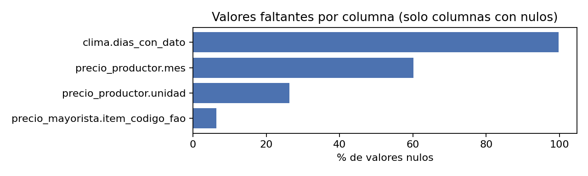
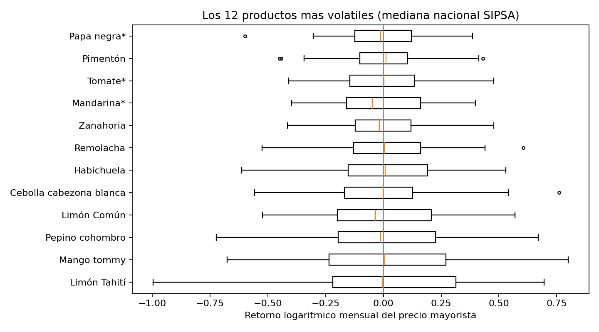
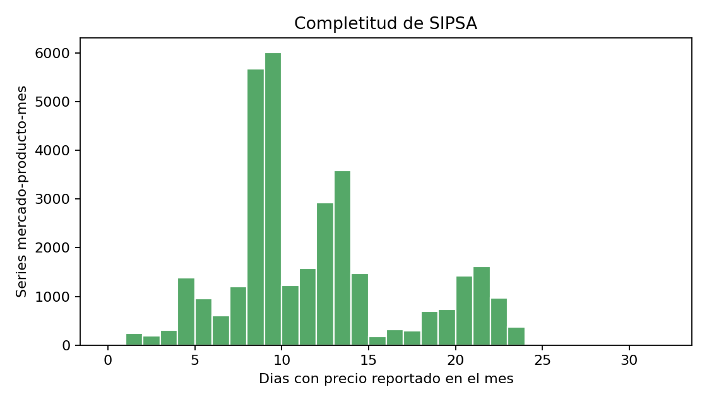
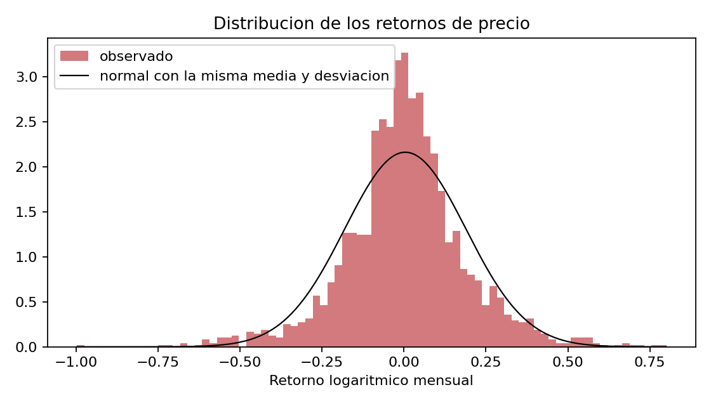
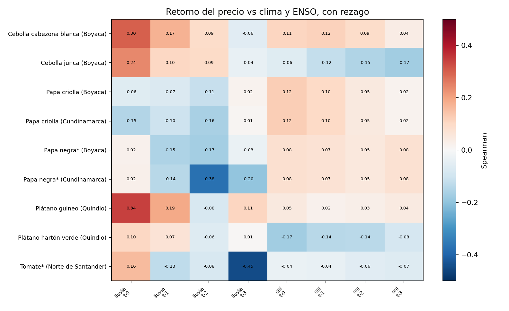

# Exploracion de datos

Generado por `scripts/exploracion.py` sobre `caso8.duckdb`. Solo cifras; la lectura la hace el equipo.

## 1. Estructura

| tabla                 |   filas |   columnas |   numericas |   texto |
|:----------------------|--------:|-----------:|------------:|--------:|
| dim_estacion_ideam    |     450 |          9 |           3 |       5 |
| dim_item_fao          |     497 |          6 |           1 |       2 |
| dim_mercado           |      20 |          2 |           1 |       1 |
| dim_producto_sipsa    |      33 |          5 |           2 |       3 |
| dim_tiempo            |     801 |          4 |           3 |       0 |
| dim_zona_productora   |       9 |          5 |           3 |       2 |
| fact_balance          |   24399 |          8 |           4 |       3 |
| fact_clima            |    3861 |         10 |           7 |       3 |
| fact_comercio         |   79395 |          8 |           4 |       3 |
| fact_enso             |     919 |          6 |           3 |       2 |
| fact_insumos          |   50383 |          6 |           4 |       2 |
| fact_precio_mayorista |   33953 |         13 |           8 |       3 |
| fact_precio_productor |   13489 |         10 |           5 |       4 |
| fact_produccion       |   20468 |          8 |           4 |       3 |
| fact_sensor_ideam     |     600 |          8 |           6 |       2 |
| fact_tasa_cambio      |     511 |          9 |           4 |       5 |
| fact_valor_produccion |   20820 |          8 |           4 |       3 |
| puente_producto       |      33 |          5 |           1 |       3 |
| puente_zona_sipsa     |       9 |          3 |           0 |       3 |

## 2. Faltantes

| tabla                 | columna         |   pct_nulos |
|:----------------------|:----------------|------------:|
| fact_clima            | dias_con_dato   |       99.77 |
| fact_precio_productor | mes             |       60.2  |
| fact_precio_productor | unidad          |       26.29 |
| fact_precio_mayorista | item_codigo_fao |        6.34 |

## 3. Atipicos (regla de Tukey sobre retornos mensuales)

| producto                |   n |   desv |   atipicos |
|:------------------------|----:|-------:|-----------:|
| Limón Tahití            |  64 | 0.3738 |          0 |
| Mango tommy             |  64 | 0.3709 |          0 |
| Pepino cohombro         |  64 | 0.3198 |          0 |
| Limón Común             |  64 | 0.2618 |          0 |
| Cebolla cabezona blanca |  64 | 0.2526 |          1 |
| Habichuela              |  64 | 0.2482 |          0 |
| Remolacha               |  64 | 0.2382 |          1 |
| Zanahoria               |  64 | 0.1979 |          0 |
| Mandarina*              |  64 | 0.1974 |          0 |
| Tomate*                 |  64 | 0.1931 |          0 |
| Pimentón                |  64 | 0.1874 |          3 |
| Papa negra*             |  64 | 0.1812 |          1 |
| Papa criolla            |  64 | 0.1781 |          1 |
| Maracuyá                |  64 | 0.1654 |          0 |
| Arveja verde en vaina   |  64 | 0.1644 |          0 |
| Aguacate*               |  64 | 0.1561 |          2 |
| Granadilla              |  64 | 0.1535 |          1 |
| Cebolla junca           |  64 | 0.1456 |          1 |
| Tomate de árbol         |  64 | 0.1452 |          1 |
| Papaya maradol          |  64 | 0.1439 |          4 |
| Ahuyama                 |  64 | 0.1244 |          0 |
| Naranja*                |  64 | 0.1201 |          4 |
| Mora de Castilla        |  64 | 0.1194 |          0 |
| Chócolo mazorca         |  64 | 0.1181 |          1 |
| Arracacha*              |  64 | 0.107  |          4 |
| Plátano guineo          |  64 | 0.1069 |          2 |
| Guayaba*                |  64 | 0.1036 |          0 |
| Plátano hartón verde    |  64 | 0.0954 |          1 |
| Lulo                    |  64 | 0.0917 |          1 |
| Piña *                  |  64 | 0.091  |          0 |
| Yuca*                   |  64 | 0.0838 |          3 |
| Coco                    |  64 | 0.0588 |          2 |
| Banano*                 |  64 | 0.0456 |          2 |

## 4. Calidad: completitud de SIPSA

|               |   count |   mean |   std |   min |   25% |   50% |   75% |   max |   pct_meses_menos_10_dias |
|:--------------|--------:|-------:|------:|------:|------:|------:|------:|------:|--------------------------:|
| dias_con_dato |   33953 |   11.4 |     5 |     1 |     8 |    10 |    13 |    23 |                     48.75 |

Meses sin ningun dato en el servicio web de SIPSA (todos los productos):

| desde   | hasta   |   meses_faltantes |   meses_esperados |
|:--------|:--------|------------------:|------------------:|
| 2021-01 | 2022-01 |                13 |                80 |

## 5. Distribucion de retornos

|    n |   media |   desv |   asimetria |   curtosis_exceso |   pct_fuera_de_2_desv |
|-----:|--------:|-------:|------------:|------------------:|----------------------:|
| 2112 |  0.0042 | 0.1846 |      -0.065 |             2.102 |                  6.01 |

## 6. Correlaciones (Spearman, rezago 0-3 meses, n >= 24)

Pares con |rho| >= 0,3: **3** de 72.

| producto       | departamento       | variable   |   rezago_meses |   n |   spearman |
|:---------------|:-------------------|:-----------|---------------:|----:|-----------:|
| Tomate*        | Norte de Santander | lluvia     |              3 |  64 |     -0.447 |
| Papa negra*    | Cundinamarca       | lluvia     |              2 |  64 |     -0.375 |
| Plátano guineo | Quindio            | lluvia     |              0 |  64 |      0.343 |
